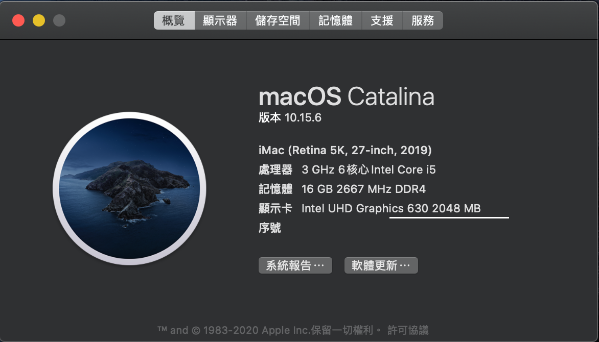

# DeskMini Hackintosh

### 系统信息

+ 操作系统版本: macOS Catalina 10.15.6 x86_64 / (SMBIOS: iMac19,1)
+ OC版本: 0.6.3
+ CPU: Intel i5-8500 (6c6t) @ 3.0GHz
+ GPU: Intel UHD Graphics 630
+ 无线网卡: BCM94360CS2
+ SSD:  [WD SN550 1TB](https://shop.westerndigital.com/zh-tw/products/internal-drives/wd-blue-sn550-nvme-ssd#WDS100T2B0C)
+ RAM: 16GB x 1 [Micron Crucial DDR4 2666]
+ Monitor: [BenQ VZ2350]

### TELEGRAM
[Join Telegram](https://t.me/asrock_deskmini)

### 无线网卡

型号是BCM94360CS2，需要配合NGFF板子。SSD使用的是RC500，主要是单面颗粒，可以不需要延长线，虽然翘起来一点，但是不影响使用。

### BIOS设置

+ Load UEFI Defaults
+ Advanced > Chipset Configuration > Onboard HD Audio & Onboard HDMI HD Audio: Enabled
+ Advanced > Chipset Configuration > VT-d: Disabled
+ Advanced > USB Configuration     > XHCI Hand-off: Enabled
+ Advanced > CPU Configuration     > C States Support: Disabled
+ Advanced > Security              > Secure Boot: Disabled
+ Super IO Configuration -> Serial Port: Disabled
+ BOOT > CSM: Enabled

### FCPX

### CREDITS

+ [xjn819 blog](https://blog.xjn819.com/?p=7)
+ [csrutil github](https://github.com/csrutil/DeskMini)
